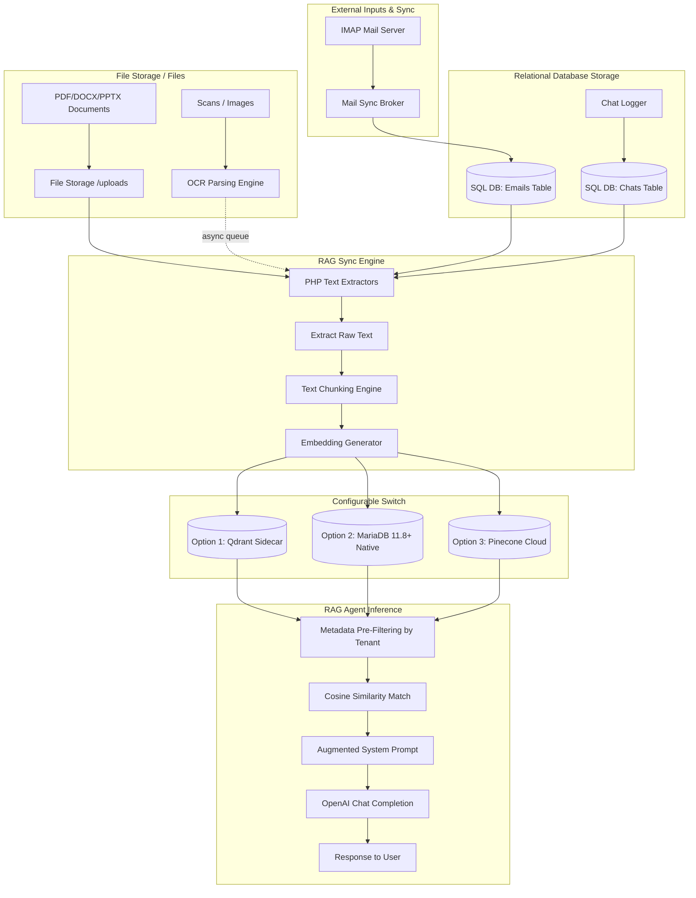

# Architectural Plan: Retrieval-Augmented Generation (RAG) System

This document outlines the proposed architecture, component designs, and deployment approaches for integrating a self-hosted RAG (Retrieval-Augmented Generation) system into the Laminam CRM (Durian release).

### Supported Data Sources & Ingestion Formats
The RAG pipeline is designed to ingest and parse various communication and document feeds:
- **PowerPoint Presentations (.pptx)**: Slide structures, titles, tables, and text shapes are parsed using native PHP extraction libraries.
- **Images and Scans (OCR)**: Scanned documents, JPGs, and PNGs are processed using a local `tesseract-ocr` wrapper to retrieve embedded textual content.
- **Client Emails**: Stored directly in the primary SQL database (synced from IMAP/SMTP brokers). The RAG engine reads the email content from the database tables, sanitizes the text body (removing HTML, signatures, and footers), and builds chunks for the vector database.
- **Chat Messages**: Logged conversations and chat message history are aggregated chronologically to build context scripts.
- **PDF & Word Documents (.pdf, .docx)**: Standard files processed via specialized extractors.

---

## 1. High-Level Architecture Flow



---

## 2. Component Design & Suggested Approaches

### Phase A: Document & Feed Parsing
To ingest a variety of client data, the extraction layer supports:

1. **Documents (PDF, DOCX, PPTX)**:
   - **PDFs**: Use `smalot/pdfparser` (native PHP library).
   - **Word Docs (.docx)**: Use `phpoffice/phpword` to read structure and extract paragraph runs.
   - **PowerPoints (.pptx)**: Use `phpoffice/phppresentation` to parse slides, text boxes, and shapes.
2. **Scans / Images (JPG, PNG)**:
   - Run OCR to retrieve text.
   - *Self-hosted approach*: Install `tesseract-ocr` on the Apache runner container and invoke it via PHP shell command wrapper (`exec("tesseract img.png stdout")`).
3. **Emails**:
   - Retrieve email communications directly from the primary relational database storage tables (where they are saved by the system's IMAP/SMTP mail sync broker).
   - Extract and sanitize the raw text body (stripping HTML tags, footers, signatures), then forward the text directly to the vector chunking and embedding generation pipeline.
4. **Chat Messages**:
   - Aggregate chat conversations or message logs grouped by client ID into chronological conversation scripts.

* **OCR Asynchronous Execution**:
  - Due to the high CPU cost and slow execution of Tesseract OCR, image extraction MUST be dispatched to an asynchronous queue (`rag_tasks` table) and processed by a background worker daemon to prevent blocking Apache web threads.

---

### Phase B: Text Chunking Strategy
* **Approach**: To prevent context loss, chunk the **raw extracted text directly** (do not rely on a lossy AI summary as the source of truth).
  - Split the raw text into chunks of **500–1000 characters** with a **10% overlap** (e.g. 100 characters) to ensure context isn't lost across boundaries.
  - Prefix each chunk with explicit metadata (e.g., `# Client: Ján Novák, Document: Contract v2, Date: 2026-05-15`) so the vector retains high-level semantic context.

---

### Phase C: Embeddings Generation
* **Option 1 (OpenAI - Internet Dependent)**: Use the `text-embedding-3-small` or `text-embedding-ada-002` API endpoint. Highly accurate and cheap, but not self-hosted.
* **Option 2 (Self-Hosted Sidecar)**: Spin up a lightweight Python FastAPI service container running `SentenceTransformers` (specifically `all-MiniLM-L6-v2` or `bge-small-en-v1.5`). It generates embeddings locally via a REST API:
  `POST http://embeddings-service/embed` -> returns the vector float array.

---

### Phase D: Active Selection & Vector Database Options
When RAG is activated, the system provides a configuration panel allowing the user to select their desired vector storage backend. To prevent maintenance overhead and ensure extreme performance, we strictly support only the following three robust backends:

1. **Option 1: Qdrant (Dedicated Sidecar Container)**: Can be selected on any infrastructure to delegate vector storage/search to a highly optimized sidecar service.
2. **Option 2: MariaDB 11.8+ (Primary Database Native Vectors)**: If the system detects that the primary CRM database runs on MariaDB v11.8 or higher, this selection becomes active. Vectors are stored natively using the `VECTOR` datatype, utilizing standard HNSW indexes.
3. **Option 3: Pinecone Cloud (External Managed Service)**: Always available for selection since it runs as an external cloud SaaS. It requires configuring a Pinecone API key and active index URL in the system settings.

---

### Vector Database Engine Specifications

#### Option 1: Qdrant Container (Recommended Sidecar)
* **Description**: A dedicated vector database running as a standalone container.
* **Query interface**: PHP cURL calling JSON REST API endpoints.
* **Security/RBAC**: Embeddings must include `client_id` payload metadata. Queries must utilize a `must` filter on the payload to enforce strict tenant isolation.
* **Pros**: Built-in HNSW index, high performance, tiny resource footprint.

#### Option 2: MariaDB 11.8+ (Native Vector Support)
* **Description**: MariaDB 11.8 introduced a native `VECTOR` data type, vector functions, and HNSW indexes.
* **Query interface**: Standard SQL.
  - Schema: `embedding VECTOR(1536)` (or 384 dimensions for local model).
  - Search (Tenant Isolated): 
    ```sql
    SELECT id, chunk_text, VEC_DISTANCE(embedding, :query_vector) AS dist
    FROM document_chunks
    WHERE client_id = :active_client_id
    ORDER BY dist ASC
    LIMIT 5;
    ```
* **Pros**: 100% relational integration, easy to enforce SQL `WHERE` clauses for RBAC isolation.

#### Option 3: Pinecone Cloud (External Managed Service)
* **Description**: A fully managed cloud vector database service.
* **Query interface**: HTTPS REST API using PHP cURL.
* **Security/RBAC**: Embeddings must be upserted with `client_id` metadata. Search requests must include a metadata filter (`$eq: client_id`) to ensure cross-tenant data leaks cannot occur.
* **Pros**: Always available, scales automatically, offloads indexing RAM overhead from local servers.

---

## 3. Key Caveats & Security Requirements

1. **Tenant Isolation (Critical Security)**:
   - Vector nearest-neighbor matching is completely semantic. Without explicit filtering, an employee could query the CRM and be served highly confidential chunks from a different client. **Every query MUST be pre-filtered by `client_id` metadata** in the vector database query itself.
2. **Dimension Mismatch Re-indexing**:
   - You cannot compare 384-dimensional vectors against 1536-dimensional vectors, nor insert them into the same strict MariaDB schema. If the system admin changes the Embedding Model (e.g., switches from local SentenceTransformers to OpenAI API), the entire vector database and chunk schema **must be purged and fully re-indexed** using the new dimension size.
3. **Asynchronous Processing**:
   - Running Tesseract OCR or large PDF parsing in a synchronous Apache/PHP thread is a DoS vector. These must be dispatched to an asynchronous queue database table (`rag_tasks`) and handled by a background worker daemon.

---

## 4. Proposed Database Schema

### Table: `document_chunks` (For MariaDB search)
| Column | Type | Description |
| :--- | :--- | :--- |
| `id` | `INT AUTO_INCREMENT PRIMARY KEY` | Unique ID |
| `client_id` | `VARCHAR(64) INDEX` | **CRITICAL:** For RBAC tenant isolation filtering |
| `source_file` | `VARCHAR(255)` | Original filename or log reference |
| `chunk_text` | `TEXT` | Split raw chunk string |
| `embedding` | `VECTOR(1536)` | Dimension size must dynamically match the active model |

---

## 5. RAG Control Panel & Environment Adaptability

The system settings screen will feature a dedicated **RAG Status & Environment Diagnostics Panel**. This control panel dynamically assesses system resources, configured settings, and shell binaries to determine which formats and databases can actively be ingested.

Each data source is mapped to a validation diagnostic check, featuring visual glowing indicator badges in the UI (**Green** = Fully Ready, **Red** = Unconfigured/Disabled):

| Feature / Data Source | Ingested Formats | Diagnostics Validation Check | Red Indicator Behavior |
| :--- | :--- | :--- | :--- |
| **PDF Ingest** | `.pdf` | Verify class `Smalot\PdfParser\Parser` loadable & PHP `memory_limit >= 128M`. | **Glows Red** if limits too low; warning displayed when importing large PDFs. |
| **Office Documents** | `.docx`, `.pptx` | Check if PHP extensions `xml` and `zip` are loaded in runtime. | **Glows Red** if extensions missing; files rejected upon import. |
| **OCR Scan Engine** | `.png`, `.jpg`, `.jpeg` | Execute shell query checking if `tesseract` binary is present in system `$PATH` (`which tesseract`). | **Glows Red** if binary missing; disables scanned file ingestion and shows "OCR Engine (Tesseract) Missing". |
| **Email Sync Ingest** | Database mail table | Probe the validation state of the system IMAP/SMTP mail server settings. | **Glows Red** if IMAP credentials are not configured or inactive; pauses automatic email database ingestion. |
| **Chat Message Ingest** | Database chat log table | Probe status of core SQL database tables (always active). | **Always Green** (native CRM logs). |
| **Vector DB Backends** | Embeddings storage | Ping Qdrant host, probe SQL connection version string (`MariaDB >= 11.8.0`), or ping Pinecone API endpoints. | **Glows Red** and disables selection switch if local engine is unreachable, SQL version check fails, or Pinecone API key/Index URL is missing. |

