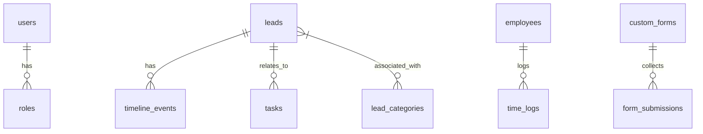

# Database Schema Specifications (MySQL)

This document outlines the high-fidelity database schema required to persist the Laminam CRM state. It models all mock entities currently used in the client-side application and provides clean, index-optimized MySQL DDL scripts.

---

## 1. Entity Relationship Overview



---

## 2. Table-by-Table Schema DDL

### 2.1. System Users & RBAC
Models employee accounts, active credentials, and system access levels (RBAC).

```sql
CREATE TABLE IF NOT EXISTS `users` (
  `id` VARCHAR(50) NOT NULL,
  `name` VARCHAR(100) NOT NULL,
  `email` VARCHAR(150) NOT NULL UNIQUE,
  `password_hash` VARCHAR(255) NOT NULL,
  `role` ENUM('admin', 'project_manager', 'viewer') NOT NULL DEFAULT 'viewer',
  `avatar` VARCHAR(255) NULL,
  `created_at` TIMESTAMP DEFAULT CURRENT_TIMESTAMP,
  `updated_at` TIMESTAMP DEFAULT CURRENT_TIMESTAMP ON UPDATE CURRENT_TIMESTAMP,
  PRIMARY KEY (`id`),
  INDEX idx_user_email (`email`)
) ENGINE=InnoDB DEFAULT CHARSET=utf8mb4 COLLATE=utf8mb4_unicode_ci;

CREATE TABLE IF NOT EXISTS `permissions` (
  `id` INT AUTO_INCREMENT PRIMARY KEY,
  `slug` VARCHAR(100) NOT NULL UNIQUE,
  `description` VARCHAR(255) NULL
) ENGINE=InnoDB DEFAULT CHARSET=utf8mb4 COLLATE=utf8mb4_unicode_ci;

CREATE TABLE IF NOT EXISTS `role_permissions` (
  `role` ENUM('admin', 'project_manager', 'viewer') NOT NULL,
  `permission_slug` VARCHAR(100) NOT NULL,
  PRIMARY KEY (`role`, `permission_slug`),
  FOREIGN KEY (`permission_slug`) REFERENCES `permissions` (`slug`) ON DELETE CASCADE
) ENGINE=InnoDB DEFAULT CHARSET=utf8mb4 COLLATE=utf8mb4_unicode_ci;
```

### 2.2. Leads Registry
Stores both basic and extended client parameters, company indicators, and interested categories.

```sql
CREATE TABLE IF NOT EXISTS `leads` (
  `id` VARCHAR(50) NOT NULL,
  `name` VARCHAR(150) NOT NULL COMMENT 'Client/Company Name',
  `city` VARCHAR(100) NULL,
  `client_type` ENUM('person', 'business', 'partner') NOT NULL DEFAULT 'person',
  `status` VARCHAR(50) NOT NULL DEFAULT 'new' COMMENT 'Active Pipeline State',
  `source` VARCHAR(50) NOT NULL DEFAULT 'website' COMMENT 'Marketing Source',
  `owner` VARCHAR(100) NOT NULL COMMENT 'Assigned Project Manager Name',
  `value` DECIMAL(12,2) NOT NULL DEFAULT 0.00 COMMENT 'Estimated Opportunity Worth',
  `rating` INT NOT NULL DEFAULT 3 COMMENT 'Star Rating 1-5',
  `phone` VARCHAR(30) NULL,
  `email` VARCHAR(150) NULL,
  
  -- Corporate registry fields
  `company_id` VARCHAR(50) NULL COMMENT 'IČO',
  `tax_id` VARCHAR(50) NULL COMMENT 'DIČ',
  `vat_id` VARCHAR(50) NULL COMMENT 'IČ DPH',
  `contact_person` VARCHAR(100) NULL,
  `website` VARCHAR(255) NULL,
  
  -- Address details
  `street` VARCHAR(255) NULL,
  `postal_code` VARCHAR(20) NULL,
  `country` VARCHAR(100) NULL DEFAULT 'Slovakia',
  
  `created_at` DATE NOT NULL,
  `updated_at` TIMESTAMP DEFAULT CURRENT_TIMESTAMP ON UPDATE CURRENT_TIMESTAMP,
  PRIMARY KEY (`id`),
  INDEX idx_lead_status (`status`),
  INDEX idx_lead_owner (`owner`),
  INDEX idx_lead_created (`created_at`)
) ENGINE=InnoDB DEFAULT CHARSET=utf8mb4 COLLATE=utf8mb4_unicode_ci;

-- Interested stone categories link table
CREATE TABLE IF NOT EXISTS `lead_categories` (
  `lead_id` VARCHAR(50) NOT NULL,
  `category_name` VARCHAR(100) NOT NULL,
  PRIMARY KEY (`lead_id`, `category_name`),
  FOREIGN KEY (`lead_id`) REFERENCES `leads` (`id`) ON DELETE CASCADE
) ENGINE=InnoDB DEFAULT CHARSET=utf8mb4 COLLATE=utf8mb4_unicode_ci;
```

### 2.3. Chronological Event Timeline
Maintains logged logs, chronological phone/email activities, and system file uploads associated with a lead/client profile.

```sql
CREATE TABLE IF NOT EXISTS `timeline_events` (
  `id` VARCHAR(50) NOT NULL,
  `lead_id` VARCHAR(50) NOT NULL,
  `type` ENUM('phone', 'email', 'note', 'offer', 'appointment') NOT NULL DEFAULT 'note',
  `timestamp` DATETIME NOT NULL,
  `title` VARCHAR(255) NOT NULL,
  `content` TEXT NULL,
  
  -- Offer/Document fields
  `amount` DECIMAL(12,2) NULL,
  `file_name` VARCHAR(255) NULL,
  `file_size` VARCHAR(50) NULL,
  `file_type` ENUM('offer', 'contract', 'invoice') NULL,
  
  -- Appointment link
  `extra_time` VARCHAR(10) NULL,
  
  PRIMARY KEY (`id`),
  FOREIGN KEY (`lead_id`) REFERENCES `leads` (`id`) ON DELETE CASCADE,
  INDEX idx_event_timestamp (`timestamp`),
  INDEX idx_event_type (`type`)
) ENGINE=InnoDB DEFAULT CHARSET=utf8mb4 COLLATE=utf8mb4_unicode_ci;
```

### 2.4. Tasks Board
Models structural task records, PM assignees, and deadlines.

```sql
CREATE TABLE IF NOT EXISTS `tasks` (
  `id` VARCHAR(50) NOT NULL,
  `title` VARCHAR(255) NOT NULL,
  `description` TEXT NULL,
  `priority` ENUM('low', 'medium', 'high') NOT NULL DEFAULT 'medium',
  `deadline` DATE NOT NULL,
  `status` ENUM('todo', 'in_progress', 'blocked', 'done') NOT NULL DEFAULT 'todo',
  `owner` VARCHAR(100) NOT NULL COMMENT 'Assigned Project Manager Name',
  `related_lead_id` VARCHAR(50) NULL,
  `created_at` TIMESTAMP DEFAULT CURRENT_TIMESTAMP,
  `updated_at` TIMESTAMP DEFAULT CURRENT_TIMESTAMP ON UPDATE CURRENT_TIMESTAMP,
  PRIMARY KEY (`id`),
  FOREIGN KEY (`related_lead_id`) REFERENCES `leads` (`id`) ON DELETE SET NULL,
  INDEX idx_task_status (`status`),
  INDEX idx_task_deadline (`deadline`)
) ENGINE=InnoDB DEFAULT CHARSET=utf8mb4 COLLATE=utf8mb4_unicode_ci;

-- Mapped users/managers assigned to task
CREATE TABLE IF NOT EXISTS `task_assignees` (
  `task_id` VARCHAR(50) NOT NULL,
  `user_name` VARCHAR(100) NOT NULL,
  PRIMARY KEY (`task_id`, `user_name`),
  FOREIGN KEY (`task_id`) REFERENCES `tasks` (`id`) ON DELETE CASCADE
) ENGINE=InnoDB DEFAULT CHARSET=utf8mb4 COLLATE=utf8mb4_unicode_ci;
```

### 2.5. Booking Calendar
Stores pending and confirmed appointments.

```sql
CREATE TABLE IF NOT EXISTS `appointments` (
  `id` VARCHAR(50) NOT NULL,
  `client_name` VARCHAR(150) NOT NULL,
  `email` VARCHAR(150) NOT NULL,
  `date` DATE NOT NULL,
  `time` TIME NOT NULL,
  `duration` INT NOT NULL DEFAULT 60 COMMENT 'Minutes',
  `status` ENUM('pending', 'confirmed', 'cancelled') NOT NULL DEFAULT 'pending',
  `notes` TEXT NULL,
  `created_at` TIMESTAMP DEFAULT CURRENT_TIMESTAMP,
  PRIMARY KEY (`id`),
  INDEX idx_app_date (`date`)
) ENGINE=InnoDB DEFAULT CHARSET=utf8mb4 COLLATE=utf8mb4_unicode_ci;
```

### 2.6. Marketing ROI
Tracks spending and conversion records per channel.

```sql
CREATE TABLE IF NOT EXISTS `marketing_channels` (
  `id` VARCHAR(50) NOT NULL,
  `name` VARCHAR(100) NOT NULL UNIQUE,
  `spend` DECIMAL(12,2) NOT NULL DEFAULT 0.00,
  `revenue` DECIMAL(12,2) NOT NULL DEFAULT 0.00,
  `leads_count` INT NOT NULL DEFAULT 0,
  `updated_at` TIMESTAMP DEFAULT CURRENT_TIMESTAMP ON UPDATE CURRENT_TIMESTAMP,
  PRIMARY KEY (`id`)
) ENGINE=InnoDB DEFAULT CHARSET=utf8mb4 COLLATE=utf8mb4_unicode_ci;
```

### 2.7. Newsletter Campaigns
Manages sent email campaigns and their tracked analytics.

```sql
CREATE TABLE IF NOT EXISTS `newsletter_campaigns` (
  `id` VARCHAR(50) NOT NULL,
  `name` VARCHAR(255) NOT NULL,
  `subject` VARCHAR(255) NOT NULL,
  `status` ENUM('draft', 'sent') NOT NULL DEFAULT 'draft',
  `sent_date` DATETIME NULL,
  `sent_count` INT NOT NULL DEFAULT 0,
  `open_rate` DECIMAL(5,2) NOT NULL DEFAULT 0.00 COMMENT 'Percentage',
  `click_rate` DECIMAL(5,2) NOT NULL DEFAULT 0.00 COMMENT 'Percentage',
  `template` TEXT NOT NULL,
  PRIMARY KEY (`id`)
) ENGINE=InnoDB DEFAULT CHARSET=utf8mb4 COLLATE=utf8mb4_unicode_ci;
```

### 2.8. Timesheets Logger
Maintains manually logged stopwatch sessions.

```sql
CREATE TABLE IF NOT EXISTS `time_logs` (
  `id` VARCHAR(50) NOT NULL,
  `project_name` VARCHAR(150) NOT NULL,
  `category` VARCHAR(100) NOT NULL,
  `description` TEXT NULL,
  `duration_seconds` INT NOT NULL DEFAULT 0,
  `date` DATE NOT NULL,
  `employee_name` VARCHAR(100) NOT NULL,
  `created_at` TIMESTAMP DEFAULT CURRENT_TIMESTAMP,
  PRIMARY KEY (`id`),
  INDEX idx_log_employee (`employee_name`),
  INDEX idx_log_date (`date`)
) ENGINE=InnoDB DEFAULT CHARSET=utf8mb4 COLLATE=utf8mb4_unicode_ci;
```

### 2.9. HR Registry
HR folder metrics.

```sql
CREATE TABLE IF NOT EXISTS `employees` (
  `id` VARCHAR(50) NOT NULL,
  `name` VARCHAR(100) NOT NULL,
  `department` VARCHAR(100) NOT NULL,
  `email` VARCHAR(150) NOT NULL UNIQUE,
  `phone` VARCHAR(30) NULL,
  `status` ENUM('active', 'on_leave', 'terminated') NOT NULL DEFAULT 'active',
  `salary` DECIMAL(12,2) NOT NULL DEFAULT 0.00,
  `hired_date` DATE NOT NULL,
  `created_at` TIMESTAMP DEFAULT CURRENT_TIMESTAMP,
  PRIMARY KEY (`id`)
) ENGINE=InnoDB DEFAULT CHARSET=utf8mb4 COLLATE=utf8mb4_unicode_ci;
```

### 2.10. Dynamic Form Builder
Persistence for the setting's Custom Form Builder modules and collected form submissions.

```sql
CREATE TABLE IF NOT EXISTS `custom_forms` (
  `id` VARCHAR(50) NOT NULL,
  `title` VARCHAR(255) NOT NULL,
  `is_active` TINYINT(1) NOT NULL DEFAULT 1,
  `fields_json` TEXT NOT NULL COMMENT 'JSON schema of inputs',
  `embed_code` TEXT NULL,
  `created_at` TIMESTAMP DEFAULT CURRENT_TIMESTAMP,
  PRIMARY KEY (`id`)
) ENGINE=InnoDB DEFAULT CHARSET=utf8mb4 COLLATE=utf8mb4_unicode_ci;

CREATE TABLE IF NOT EXISTS `form_submissions` (
  `id` VARCHAR(50) NOT NULL,
  `form_id` VARCHAR(50) NOT NULL,
  `submitted_data` TEXT NOT NULL COMMENT 'JSON stringified input values',
  `submitted_at` TIMESTAMP DEFAULT CURRENT_TIMESTAMP,
  PRIMARY KEY (`id`),
  FOREIGN KEY (`form_id`) REFERENCES `custom_forms` (`id`) ON DELETE CASCADE
) ENGINE=InnoDB DEFAULT CHARSET=utf8mb4 COLLATE=utf8mb4_unicode_ci;
```

### 2.11. Global App Configuration Settings
Flexible key-value system settings tables.

```sql
CREATE TABLE IF NOT EXISTS `system_settings` (
  `key` VARCHAR(100) NOT NULL,
  `value` TEXT NOT NULL,
  `updated_at` TIMESTAMP DEFAULT CURRENT_TIMESTAMP ON UPDATE CURRENT_TIMESTAMP,
  PRIMARY KEY (`key`)
) ENGINE=InnoDB DEFAULT CHARSET=utf8mb4 COLLATE=utf8mb4_unicode_ci;
```
