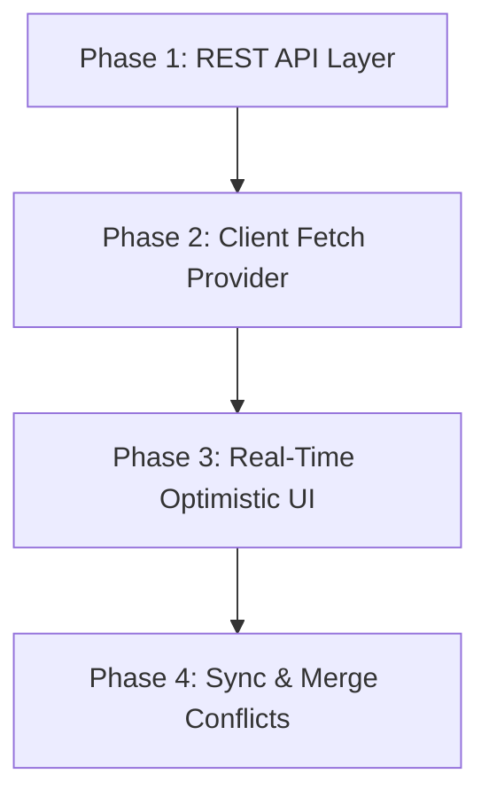

# State Persistence & Synchronization Strategy

This document outlines how the React SPA processes state updates locally and provides a step-by-step strategy to transition from client-side `localStorage` caching to dynamic, asynchronous database synchronization.

---

## 1. Current State Management Architecture

All core states (leads, clients, calendar slots, HR registry, tasks, generated templates) are defined and managed inside [src/App.tsx](file:///Users/erik/Documents/vibe%20coding/crm/src/App.tsx). State updates propagate to other views as reactive properties and are synchronized to `localStorage` under `crm_*` tags to guarantee that details are persistent across tab reloads.

### 1.1. Example Local Sync Trigger
```tsx
const [leads, setLeads] = useState<Lead[]>(() => {
  const stored = localStorage.getItem("crm_leads");
  return stored ? JSON.parse(stored) : INITIAL_LEADS;
});

useEffect(() => {
  localStorage.setItem("crm_leads", JSON.stringify(leads));
}, [leads]);
```

---

## 2. Dynamic Database Persistence Roadmap

To transition this local architecture to full MySQL persistence, the next agent must implement the following multi-phased approach.



### Phase 1: Establish API Integration Layer
1. Implement the endpoints described in `API_CONTRACTS.md` within a PHP/Laravel or custom wizard package backend.
2. Ensure proper CORS setups and token-based authentication middleware are configured to allow secure connections.

### Phase 2: Refactor State Hooks to Asynchronous Fetching
Create custom, high-order state providers or utilize `React Context` combined with data-fetching libraries like **React Query (TanStack Query)** to manage remote CRM data.

Example Context template to load leads:
```tsx
import React, { createContext, useContext, useState, useEffect } from 'react';
import type { Lead } from './types';

interface LeadContextProps {
  leads: Lead[];
  loading: boolean;
  addLead: (lead: Omit<Lead, 'id' | 'createdAt'>) => Promise<void>;
  updateLead: (id: string, updates: Partial<Lead>) => Promise<void>;
  deleteLead: (id: string) => Promise<void>;
}

const LeadContext = createContext<LeadContextProps | undefined>(undefined);

export const LeadProvider: React.FC<{ children: React.ReactNode }> = ({ children }) => {
  const [leads, setLeads] = useState<Lead[]>([]);
  const [loading, setLoading] = useState(true);

  // Fetch leads asynchronously on mount
  useEffect(() => {
    fetch('/api/leads')
      .then(res => res.json())
      .then(data => {
        setLeads(data);
        setLoading(false);
      })
      .catch(err => console.error("Error loading leads:", err));
  }, []);

  const addLead = async (newLead) => {
    const res = await fetch('/api/leads', {
      method: 'POST',
      headers: { 'Content-Type': 'application/json' },
      body: JSON.stringify(newLead)
    });
    const data = await res.json();
    if (data.success) {
      setLeads(prev => [data.lead, ...prev]);
    }
  };

  const updateLead = async (id, updates) => {
    const res = await fetch(`/api/leads/${id}`, {
      method: 'PUT',
      headers: { 'Content-Type': 'application/json' },
      body: JSON.stringify(updates)
    });
    const data = await res.json();
    if (data.success) {
      setLeads(prev => prev.map(l => l.id === id ? { ...l, ...updates } : l));
    }
  };

  const deleteLead = async (id) => {
    const res = await fetch(`/api/leads/${id}`, { method: 'DELETE' });
    if (res.ok) {
      setLeads(prev => prev.filter(l => l.id !== id));
    }
  };

  return (
    <LeadContext.Provider value={{ leads, loading, addLead, updateLead, deleteLead }}>
      {children}
    </LeadContext.Provider>
  );
};
```

### Phase 3: Optimistic UI Updates
For performance operations (such as **drag-and-drop column switches** on the Kanban board or **rating stars clicks** inside list grids), implement optimistic updates:
1. Instantly update the local UI state before the server request finishes.
2. Save the original state in a temporary buffer.
3. If the server request encounters an issue (e.g., network failure, unauthorized access), trigger a subtle banner and gracefully roll back the UI to the buffered original state.

### Phase 4: Local Storage Backup fallback (Offline Mode)
To keep the application highly resilient:
1. Persist local actions inside IndexedDB or a `localStorage` sync queue when connection fails.
2. Periodically check server ping (`navigator.onLine`).
3. Re-sync offline submissions and updates sequentially as soon as the network returns.
