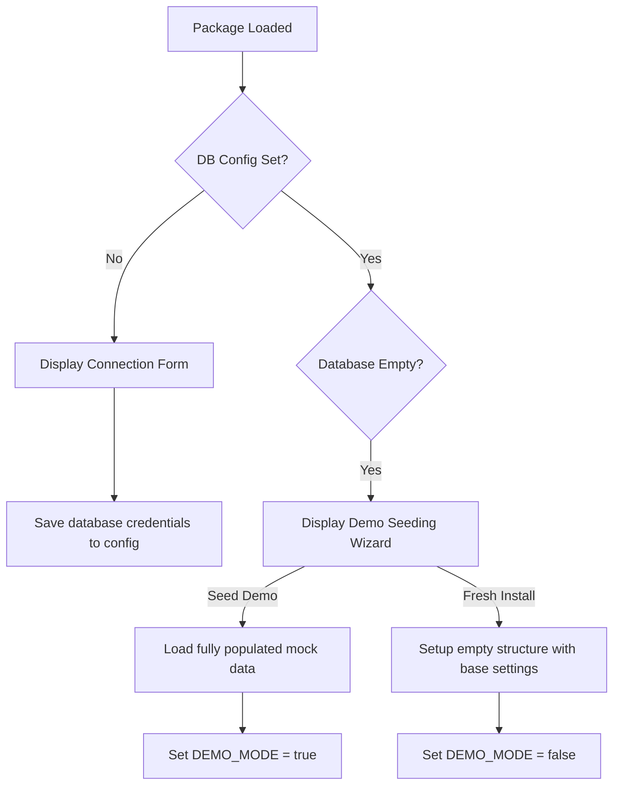

# Installation Wizard & Demo Mode Specifications

This document outlines the architectural specifications for the composer package installer wizard, demo mode state persistence, and database clean-up commands as outlined in the [dbbuildinginstructions.md](file:///Users/erik/Documents/vibe%20coding/crm/dbbuildinginstructions.md).

---

## 1. Installer Wizard Pipeline Flow



---

## 2. Database Wizard Connection Form

The connection phase must display a high-fidelity visual interface asking the user to submit connection specifications:
- **Host Address**: (e.g. `db.example-host.tld`)
- **Port Number**: (e.g. `3306`)
- **Database Name**: (e.g. `your_database_name`)
- **Username**: (e.g. `your_database_user`)
- **Password**: (your database password — never commit real values)

Once submitted, the system attempts a connection test using standard PHP PDO connection flags.
If successful:
- It saves database credentials to a persistent config file (e.g. `.env` or `config.php`).
- It applies the database migrations (DDL queries outlined in `SCHEMA.md`).
- It prompts the user to select their installation type: **"Seed with Demo Data (Recommended for Testing)"** or **"Start Fresh (Empty Database)"**.

---

## 3. Demo Mode Implementation Specs

If the user installs demo data:
1. Populate all tables sequentially with initial mock entities from `src/utils/mockData.ts`.
2. Save a configuration parameter `DEMO_MODE` as `true` (persisted in the `system_settings` table and synchronized to local storage).

### 3.1. Visual Indicators (Header & settings)
- **Header indicator**: If `DEMO_MODE` is `true`, a prominent, styled badge must render in the Header:
  ```tsx
  {isDemoMode && (
    <a 
      href="#settings"
      className="px-3 py-1.5 rounded-xl bg-amber-500 hover:bg-amber-600 border border-amber-600 text-white text-[10px] font-black uppercase tracking-wider shadow-md shadow-amber-500/25 transition-all flex items-center gap-1 hover:scale-[1.02]"
    >
      <span className="h-2 w-2 rounded-full bg-white animate-pulse" />
      DEMO MODE
    </a>
  )}
  ```
  *Clicking this badge redirect's the user directly to the Settings tab, where they are prompted to remove the demo data.*

- **Settings panel**: In the settings module, if `DEMO_MODE` is active, display a dedicated control section allowing administrators to easily wipe demo data.

---

## 4. Wiping Demo Data (Database Cleanup Process)

When clicking **"Wipe Demo Data"**, prompt the administrator with an interactive modal asking:
> **Keep Configurations?**
> Do you want to preserve your configured marketing channels, custom categories, and pipeline state colors (e.g. new, contacted, offer sent, etc.)?

### 4.1. Clean-Up Execution Flow (Backend PHP Script)

If **"Wipe Everything"** is selected, execute:
```php
<?php
// wipe_demo.php
require_once 'config.php';

try {
    $pdo->beginTransaction();

    // Wipe all transactional tables
    $pdo->exec("SET FOREIGN_KEY_CHECKS = 0;");
    $pdo->exec("TRUNCATE TABLE `form_submissions`;");
    $pdo->exec("TRUNCATE TABLE `time_logs`;");
    $pdo->exec("TRUNCATE TABLE `newsletter_campaigns`;");
    $pdo->exec("TRUNCATE TABLE `appointments`;");
    $pdo->exec("TRUNCATE TABLE `task_assignees`;");
    $pdo->exec("TRUNCATE TABLE `tasks`;");
    $pdo->exec("TRUNCATE TABLE `timeline_events`;");
    $pdo->exec("TRUNCATE TABLE `lead_categories`;");
    $pdo->exec("TRUNCATE TABLE `leads`;");
    
    // Wipe customizable lists if "Keep Configs" was false
    if (!$keepConfigs) {
        $pdo->exec("TRUNCATE TABLE `marketing_channels`;");
        $pdo->exec("TRUNCATE TABLE `employees`;");
        $pdo->exec("TRUNCATE TABLE `custom_forms`;");
        $pdo->exec("TRUNCATE TABLE `system_settings`;");
    } else {
        // Keep states but clean transactional records
        // Update DEMO_MODE setting to false
        $stmt = $pdo->prepare("UPDATE `system_settings` SET `value` = 'false' WHERE `key` = 'DEMO_MODE'");
        $stmt->execute();
    }
    
    $pdo->exec("SET FOREIGN_KEY_CHECKS = 1;");
    $pdo->commit();
    echo json_encode(["success" => true, "message" => "Demo data successfully removed."]);
} catch (Exception $e) {
    $pdo->rollBack();
    echo json_encode(["success" => false, "message" => $e->getMessage()]);
}
```

This ensures a smooth, non-destructive clearing of transactions while optionally preserving the customized look & feel of the pipeline!
