# 📊 Prezentácia systému Koperniq: Prehľad modulov a ich hodnota pre firmu

---

## 0. 🔐 Bezpečné prihlásenie & Role-Based Access

### Kľúčové funkcie:
* **Autentifikácia so správou rolí (RBAC)**: Rýchle prepínanie a prihlasovanie s overením na strane servera.
* **Bezpečnostné štandardy**: Ochrana proti brute-force útokom, šifrovanie relácií, reset hesla cez email.

---

## 1. 💼 Obchod & Predajný lievik (Leads / Deals)

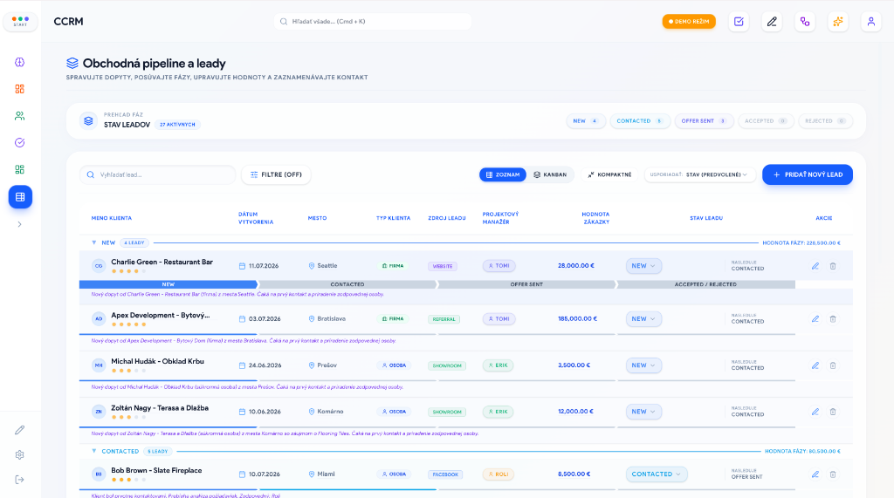

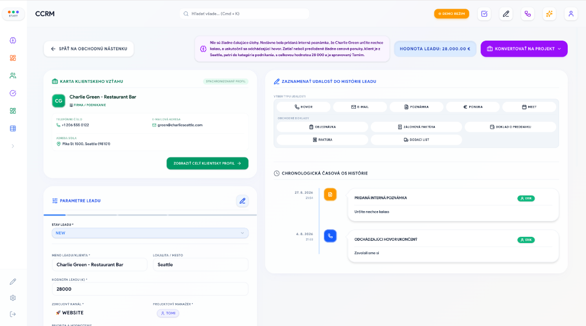

### Kľúčové funkcie:
* **Duálne zobrazenie (Kanban & DataGrid)**: Vizuálne posúvanie obchodov po fázach predaja a vysokovýkonná tabuľka pre hromadné úpravy.
* **Prispôsobiteľné fázy predaja s farebným odlíšením**: Nastavenie predajného procesu presne podľa reality firmy (*Dopyt ➔ Cenová ponuka ➔ Vyjednávanie ➔ Uzavreté / Stratené*).
* **360° Timeline komunikácie**: Chronologická história každého telefonátu, emailu, stretnutia, cenovej ponuky a zmeny stavu s priradeným autorom.
* **Hodnotenie bonity & Finančná hodnota**: Bodovanie dôležitosti zákaziek (1–5 hviezdičiek), sledovanie očakávaného obratu a zdrojov leadov (*Web, Showroom, Odporúčanie*).

### 💡 Prečo je to pre firmu užitočné:
* Poskytuje vedeniu aj obchodníkom okamžitý prehľad o tom, v akom štádiu sa nachádza každá jedna zákazka, kto ju má na starosti a aký obrat je v predajnom lieviku rozpracovaný.
* Zabezpečuje, že žiadny zákazník ani dopyt nezostane zabudnutý v neprečítanom emaile.

### 🛠️ Čo to rieši:
* **Koniec chaosu v Exceloch a zápisníkoch**: Nahrádza neprehľadné tabuľky jedným centrálnym systémom, kde každý vidí aktuálny stav.
* **Zamedzenie strate obchodných príležitostí**: Eliminuje situácie, kedy sa obchodník zabudol ozvať klientovi alebo odoslať cenovú ponuku včas.
* **Bezproblémová zastupiteľnosť**: Ak obchodník ochorie alebo odíde, kolega okamžite vidí celú históriu komunikácie a plynule pokračuje bez straty informácií.

---

## 2. 👥 Adresár klientov & Firemná inteligencia (Clients)

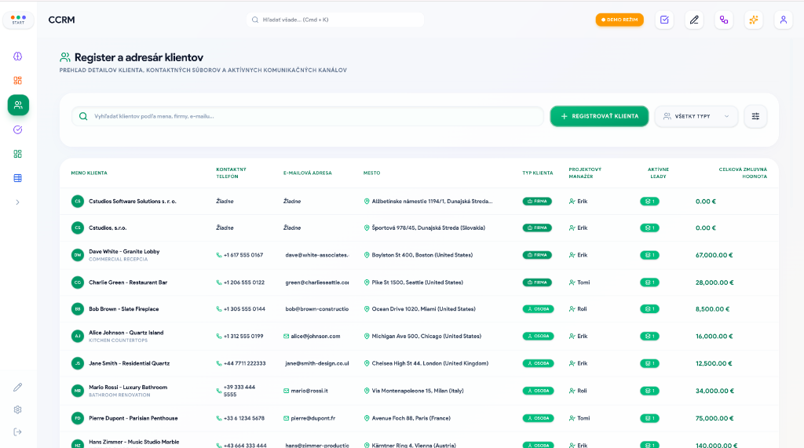

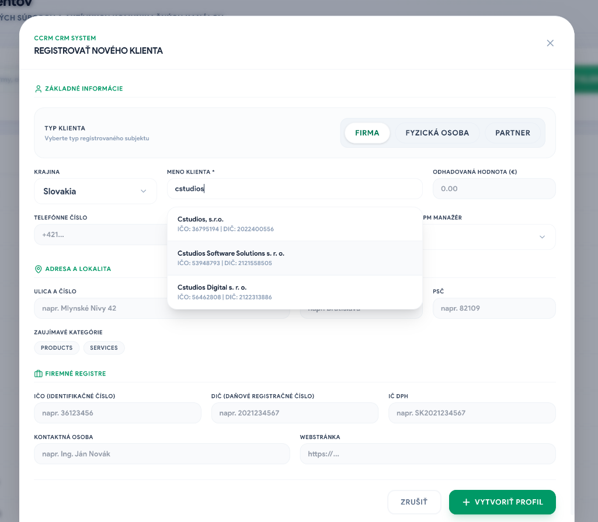

### Kľúčové funkcie:
* **Komplexná B2B & B2C databáza**: Evidencia firiem, živnostníkov, fyzických osôb a partnerov na jednom mieste.
* **Automatické dotiahnutie údajov podľa IČO (FinStat / RegisterUZ / ARES)**: Stačí zadať IČO a systém sám vyplní presný názov, sídlo, PSČ, DIČ, IČ DPH, právnu formu a SK NACE klasifikáciu.
* **Overovanie platnosti DPH (VIES)**: Okamžitá kontrola platnosti IČ DPH v európskom registri.
* **Karta klienta s prepojeniami**: Zoznam kontaktných osôb, história všetkých realizovaných zákaziek, vystavených faktúr, skladových výdajok a termínov.

### 💡 Prečo je to pre firmu užitočné:
* Šetrí desiatky hodín manuálneho vypisovania fakturačných údajov a eliminuje preklepy v názvoch či adresách firiem.
* Buduje dlhodobú hodnotu firmy – kompletnú a čistú databázu zákazníkov s ich nákupnou históriou a kontaktmi.

### 🛠️ Čo to rieši:
* **Zlé a neplatné fakturačné údaje**: Už sa nestane, že na faktúre bude zlé sídlo firmy, preklep v DIČ alebo neplatné IČ DPH.
* **Roztrúsené kontakty v telefónoch zamestnancov**: Kontakty na konateľov a nákupcov sú majetkom firmy v CRM, nie v súkromnom telefóne odchádzajúceho zamestnanca.

---

## 3. 📦 Skladové hospodárstvo & Logistika (Warehouse)

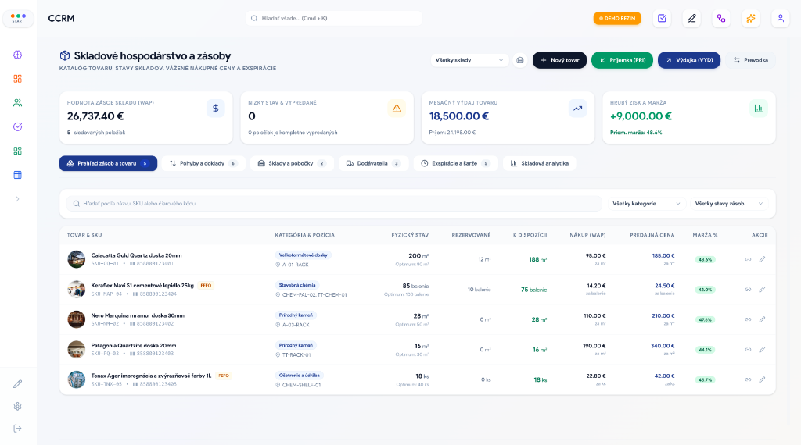

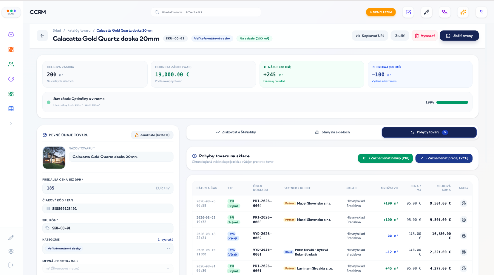

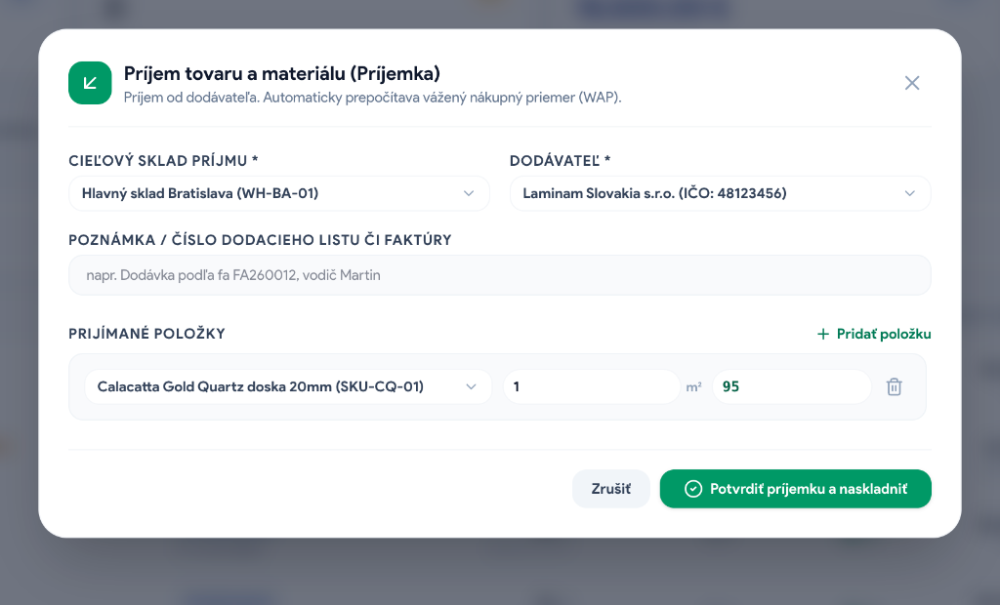

### Kľúčové funkcie:
* **Viacskladová evidencia (Multi-Warehouse)**: Správa viacerých skladov a pobočiek, presuny tovaru medzi skladmi (Prevodka).
* **Katalóg produktov, EAN kódy & merné jednotky**: Podpora rôznych jednotiek (*ks, m², bm, m³, kg, l*), generovanie a skenovanie čiarových kódov.
* **Vážená priemerná nákupná cena (WAP)**: Automatické prepočítavanie reálnej skladovej ceny materiálu po každom naskladnení.
* **Evidencia šarží a exspirácií (FEFO)**: Sledovanie čísiel šarží a automatické odporúčanie tovaru s najskoršou exspiráciou.
* **Kompletné skladové doklady s PDF exportom**:
  * 📥 **Príjemka (PRI)** – naskladnenie od dodávateľov.
  * 📤 **Výdajka (VYD)** – celoobrazovkové rozhranie s priamym prepojením na klienta, automatickou kontrolou dostupnosti tovaru, maržovým ukazovateľom a zápisom predaja do časovej osi.
  * 🔄 **Prevodka (PRE)** a 📋 **Inventúra (INV)** – medziskladové presuny a vyrovnanie manka/prebytkov.

### 💡 Prečo je to pre firmu užitočné:
* Poskytuje 100% prehľad o tom, koľko tovaru a materiálu je fyzicky na sklade, kde sa nachádza a aká je jeho presná finančná hodnota.
* Umožňuje okamžitý predaj zo skladu s automatickým výpočtom ziskovej marže a tlačou profesionálnych výdajok.

### 🛠️ Čo to rieši:
* **Manká a straty tovaru**: Presná evidencia každého pohybu tovaru (kto, kedy, komu a za koľko tovar vydal).
* **Zlé marže a predaj pod cenu**: Vďaka automatickému WAP obchodník vždy vidí reálnu nákupnú cenu a nestane sa, že predá tovar so stratou.
* **Expirovaný a zabudnutý tovar**: Systém stráži dátumy spotreby a upozorňuje na tovar, ktorý treba vydať prednostne.

---

## 4. 💰 Finančný manažment & Cash Flow (Financials)

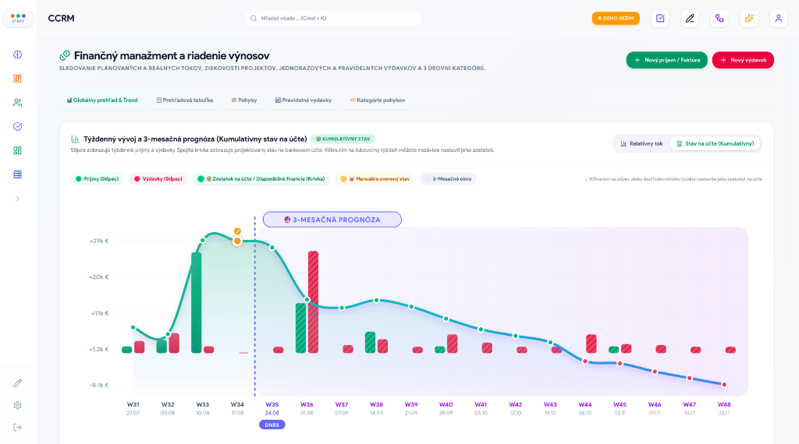

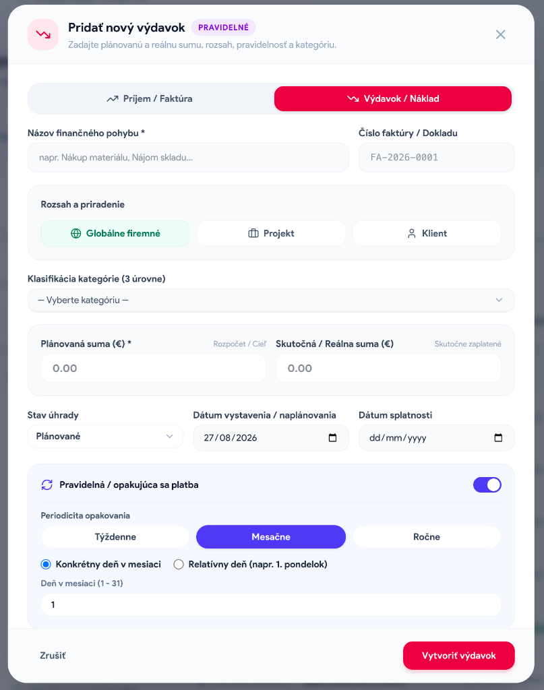

### Kľúčové funkcie:
* **Cash Flow Dashboard**: Živý prehľad reálnych príjmov vs. výdavkov, čistého zisku, marží a neuhradených faktúr.
* **Trojúrovňový hierarchický strom kategórií**: Detailné členenie nákladov a výnosov (*napr. Prevádzka ➔ Marketing ➔ Online reklama*).
* **Plánovaný vs. Reálny rozpočet**: Sledovanie plánovaných nákladov/príjmov v porovnaní s reálne zinkasovanými či uhradenými platbami.
* **Pravidelné platby (Recurring rules)**: Automatické generovanie opakujúcich sa platieb (nájmy, leasingy, mzdy, paušály).
* **Fakturačný register & DPH**: Sledovanie čísiel faktúr, splatností s farebným varovaním omeškania a prílohami dokladov (bločky, faktúry).
* **Alokácia na Projekty a Klientov**: Presné priradenie nákladov ku konkrétnej zákazke pre zistenie jej reálnej ziskovosti.

### 💡 Prečo je to pre firmu užitočné:
* Manažment má v reálnom čase pred očami finančné zdravie firmy bez toho, aby musel týždne čakať na reporty z externého účtovníctva.
* Umožňuje presné finančné plánovanie na mesiace dopredu a včasné odhalenie výpadkov cash flow.

### 🛠️ Čo to rieši:
* **Nezaplatené faktúry po splatnosti**: Okamžitý prehľad pohľadávok, ktoré treba urgovať u zákazníkov.
* **Skryté neefektívne zákazky**: Presne odhalí, ktoré projekty boli v skutočnosti stratové pre neočakávané vedľajšie náklady.
* **Zabudnuté firemné platby**: Eliminuje pokuty a penále za oneskorenú úhradu firemných záväzkov.

---

## 5. 🎯 Správa úloh & Tímová produktivita (Tasks)

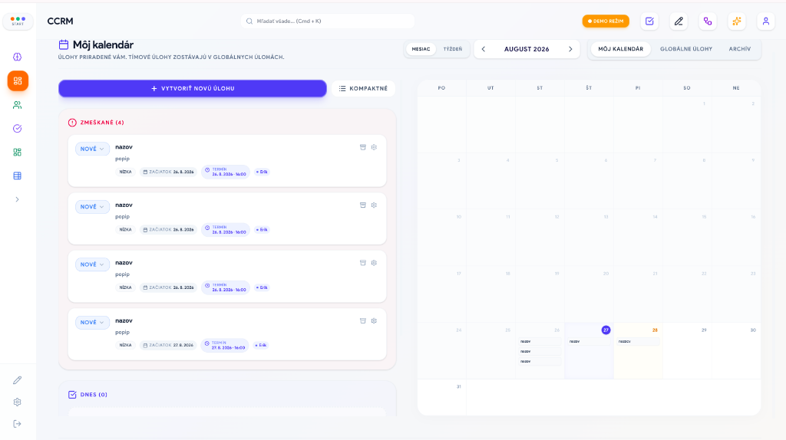

### Kľúčové funkcie:
* **Kanban nástenka a zoznamy úloh**: Rozdelenie podľa stavov (*Na vybavenie, Rozpracované, Blokované, Hotovo*) a priorít (*Nízka, Stredná, Vysoká*).
* **Viacnásobní riešitelia (Assignees)**: Priradenie viacerých kolegov k jednej úlohe s jednoznačne zaznamenaným tvorcom.
* **Presné termíny na minútu (Deadlines & Time)**: Nastavenie dátumu aj presného času vybavenia.
* **Blokujúce úlohy (Locking tasks)**: Špeciálne označenie úloh, ktoré nepustia projekt ďalej, kým nie sú splnené.
* **Prepojenie na celý systém**: Každá úloha môže patriť ku konkrétnemu klientovi, leadu, projektu alebo zápisnici.

### 💡 Prečo je to pre firmu užitočné:
* Zvyšuje disciplínu a exekúciu v tíme. Každý pracovník presne vie, čo má dnes urobiť a aké sú jeho priority.
* Manažér má okamžitú kontrolu nad vyťaženosťou a plnením termínov bez nutnosti neustáleho vypytovania sa.

### 🛠️ Čo to rieši:
* **Zabúdanie na dôležité úlohy a termíny**: Už žiadne "zabudol som" alebo "nevedel som, že to mám spraviť ja".
* **Rozpadnuté zadania v chatoch a emailoch**: Úlohy nevznikajú v neprehľadných správach, ale priamo pri zákazke s termínom a zodpovednou osobou.

---

## 6. 🏗️ Riadenie projektov & Ganttov diagram (Projects)

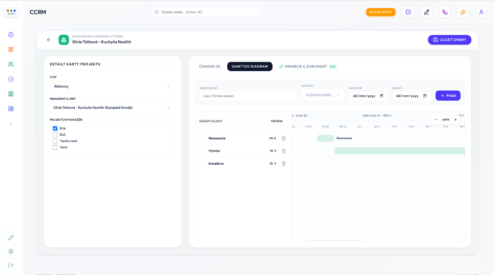

### Kľúčové funkcie:
* **Dynamické šablóny projektov**: Možnosť definovať vlastné typy projektov (napr. *Stavba strechy, Montáž kuchyne, Vývoj webu*) s vlastnými dátovými poliami a časovou osou.
* **Automatické generovanie databázových tabuliek**: Systém na pozadí pre každý typ projektu vytvorí bezpečné dedikované tabuľky bez nutnosti zásahu programátora.
* **Interaktívny Ganttov diagram**: Vizuálne plánovanie etáp, míľnikov, termínov a percentuálneho progresu prác.
* **Riadenie tímov a zodpovedností**: Priradenie projektových manažérov a realizačných tímov.

### 💡 Prečo je to pre firmu užitočné:
* Poskytuje jasnú štruktúru pre komplexné zákazky, ktoré prebiehajú týždne či mesiace.
* Umožňuje klientom aj vedeniu prezentovať profesionálny harmonogram prác a kontrolovať jeho dodržiavanie.

### 🛠️ Čo to rieši:
* **Meškanie projektov a zlé plánovanie kapacít**: Predchádza prekrývaniu termínov a kolíziám montážnych tímov.
* **Neprehľadnosť pri realizácii**: Zabezpečuje, že všetci vedia, v akej fáze sa zákazka nachádza a aké kroky nasledujú.

---

## 7. 🎙️ Zasadačka & Hlasové AI poznámky (Meeting Room)

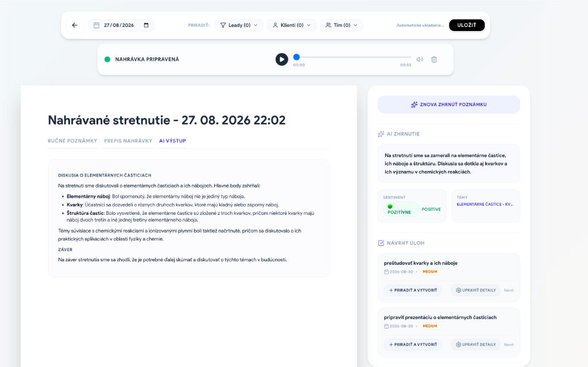

### Kľúčové funkcie:
* **Hlasový záznamník priamo v prehliadači**: Nahrávanie porád, stretnutí s klientmi alebo telefonátov s grafickou vizualizáciou zvuku.
* **Automatický prepis hlasu (Speech-to-Text cez Whisper/Gemini)**: Prevod slovenského, anglického či maďarského hovoreného slova do textu.
* **AI Zhrnutie zápisnice**: Automatické vygenerovanie prehľadných bodov, zhrnutia a prijatých rozhodnutí.
* **Automatická extrakcia úloh z hlasu**: Umelá inteligencia sama identifikuje, na čom sa účastníci dohodli, vytvorí úlohy, priradí ľudí a nastaví termíny.

### 💡 Prečo je to pre firmu užitočné:
* Drasticky šetrí čas strávený písaním zápisníc z porád a stretnutí s klientmi (úspora desiatok minút po každom meetingu).
* Zaručuje, že dohody z porady sa okamžite premenia na reálne úlohy v systéme.

### 🛠️ Čo to rieši:
* **Zbytočné porady bez výsledku**: Koniec situáciám, kedy sa po porade na dohodnuté veci zabudne.
* **Strata detailov z telefonátov a stretnutí**: Obchodník po stretnutí len nahovorí minútovú hlasovú správu a systém z nej vytvorí štruktúrovaný zápis do CRM.

---

## 8. 🧠 RAG AI Asistent & Autonómna inteligencia (Codename Imbe)

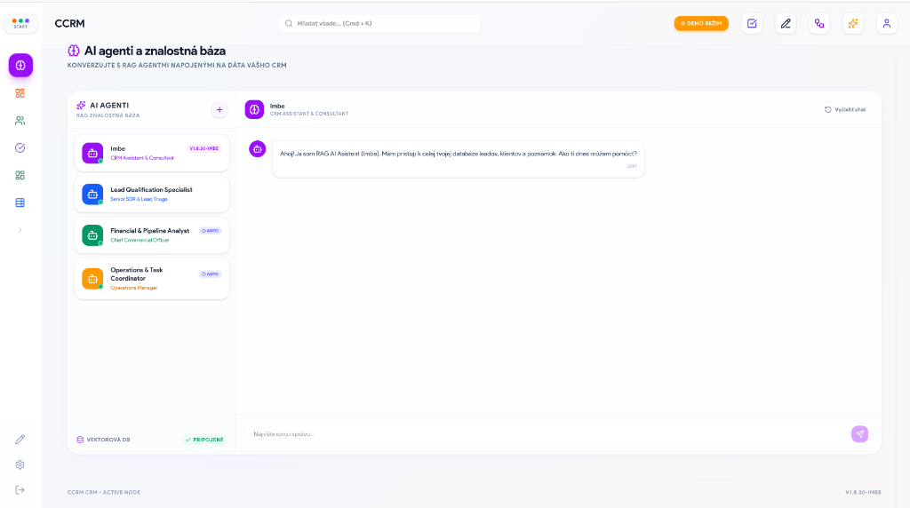

### Kľúčové funkcie:
* **Firemná vektorová databáza (MariaDB Vector Store)**: Sémantické prehľadávanie a indexovanie celej firemnej databázy.
* **Kompletná kontextová inteligencia v reálnom čase**:
  * AI asistent má prístup k Leadom, Klientom, Úlohám, Skladom, Financiám, Zápisniciam, Emailom aj Vlastným evidenciám.
  * Schopnosť odpovedať na zložité manažérske otázky prirodzeným jazykom (napr. *"Ktoré zákazky meškajú?", "Aký máme očakávaný cash flow na budúci mesiac?", "Ktorý tovar musíme doobjednať?"*).
* **Podpora diakritiky a skloňovania**: Spoľahlivo rozumie slovenskému hovorovému jazyku aj bez dĺžňov a mäkčeňov.
* **Autonómni špecializovaní agenti**: Samostatné roly (Finančný analytik, Skladový manažér, Obchodný stratég).

### 💡 Prečo je to pre firmu užitočné:
* Funguje ako 24/7 osobný dátový analytik pre majiteľa a manažérov firmy.
* Umožňuje získať okamžité odpovede na strategické otázky bez nutnosti manuálneho klikania cez filtre a exportovania dát.

### 🛠️ Čo to rieši:
* **Pomalé rozhodovanie a informačné ticho**: Namiesto hodinového hľadania informácií v systéme dostanete presnú odpoveď za 3 sekundy.
* **Zložité zaúčanie nových ľudí**: Nový zamestnanec sa môže asistenta priamo opýtať na čokoľvek ohľadom firemných záznamov a postupov.

---

## 9. 📁 Vlastné evidencie / Zjednotené entity (Unified Entries)

### Kľúčové funkcie:
* **No-Code tvorba firemných registrov**: Vytvorenie ľubovoľnej vlastnej evidencie bez programovania (napr. *Vozový park, Stroje a technika, Zmluvy a certifikáty, Reklamácie, Revízie, Licencie*).
* **Dynamické polia**: Nastavenie vlastných typov hodnôt (text, čísla, výberové polia, prílohy, väzby na klientov).
* **Sledovanie platností a exspirácií**: Vizuálny odpočet dní do konca platnosti (napr. STK, platnosť zmluvy, kalibrácia stroja) s farebným varovaním.
* **Plná integrácia do vyhľadávania a AI**: Tieto evidencie sú okamžite prehľadateľné cez globálne vyhľadávanie aj RAG AI asistenta.

### 💡 Prečo je to pre firmu užitočné:
* Systém sa dokáže prispôsobiť akémukoľvek špecifickému odvetviu a internému procesu firmy bez drahého vývoja na mieru.
* Zjednocuje všetky pomocné tabuľky a evidencie do jedného bezpečného rozhrania.

### 🛠️ Čo to rieši:
* **Prepadnuté lehoty a pokuty**: Koniec zabudnutým termínom STK, končiacim certifikátom, poistkám alebo revíziám náradia.
* **Izolované pomocné Excel súbory**: Odstraňuje neudržiavané tabuľky pohodené na sieťových diskoch.

---

## 10. ✉️ Emailový klient & Komunikačné centrum (Email)

### Kľúčové funkcie:
* **Obojsmerná IMAP / SMTP integrácia**: Plnohodnotná správa emailov priamo v prostredí CRM (*Inbox, Odoslané, Rozpísané, Kôš*).
* **AI Email Summarizer**: 1-klikové zhrnutie dlhých emailových vlákien do pár kľúčových viet.
* **Automatické priraďovanie k zákazníkom**: Systém automaticky spáruje prijatý alebo odoslaný email s časovou osou príslušného klienta a obchodného prípadu.

### 💡 Prečo je to pre firmu užitočné:
* Obchodníci a manažéri nemusia neustále prepínať medzi Outlookom/Gmailom a CRM systémom.
* Zabezpečuje, že celá komunikácia s klientom je viditeľná pre celý kompetentný tím na jednom mieste.

### 🛠️ Čo to rieši:
* **Informačné vákuum medzi oddeleniami**: Kolegovia nemusia preposielať emaily – priamo v karte klienta vidia, čo zákazník naposledy písal.
* **Časová strata pri čítaní dlhých správ**: AI zhrnutie okamžite povie, čo klient v dlhom emaile požaduje.

---

## 11. ⚡ Automatizácia procesov (Workflow Automation)

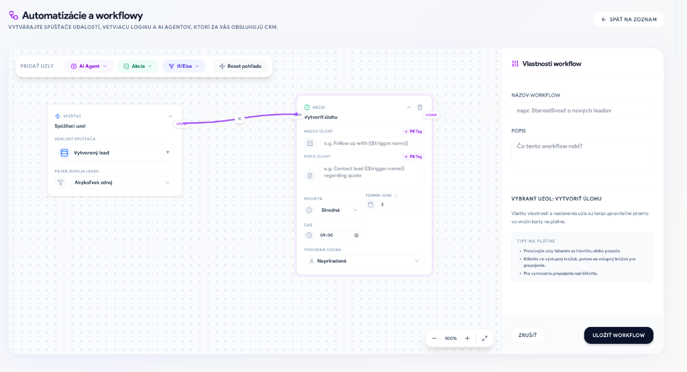

### Kľúčové funkcie:
* **Vizuálny tvorca automatizačných pravidiel**: Nastavenie logiky typu *Ak nastane udalosť (Trigger) ➔ Vykonaj akciu (Action)*.
* **Spúšťače (Triggers)**: Nový lead z webu, zmena fázy zákazky, dokončenie úlohy, pokles tovaru na sklade pod minimum, faktúra po splatnosti.
* **Akcie (Actions)**: Automatické odoslanie emailu/SMS, pridelenie úlohy konkrétnemu človeku, notifikácia vedeniu, volanie externých Webhookov.

### 💡 Prečo je to pre firmu užitočné:
* Eliminuje rutinnú, opakujúcu sa manuálnu prácu zamestnancov.
* Zrýchľuje reakčný čas firmy – zákazník dostane odpoveď alebo ponuku okamžite po odoslaní formulára.

### 🛠️ Čo to rieši:
* **Ľudská chybovosť a zábudlivosť**: Rutinné procesy (napr. odoslanie uvítacieho emailu alebo upozornenie na zálohovú faktúru) bežia spoľahlivo a automaticky.
* **Zbytočná administratívna záťaž**: Zamestnanci sa môžu venovať obchodu a realizácii namiesto mechanického prepisovania dát.

---

## 12. 📱 Sociálne siete & Zber dopytov (Social Media Hub)

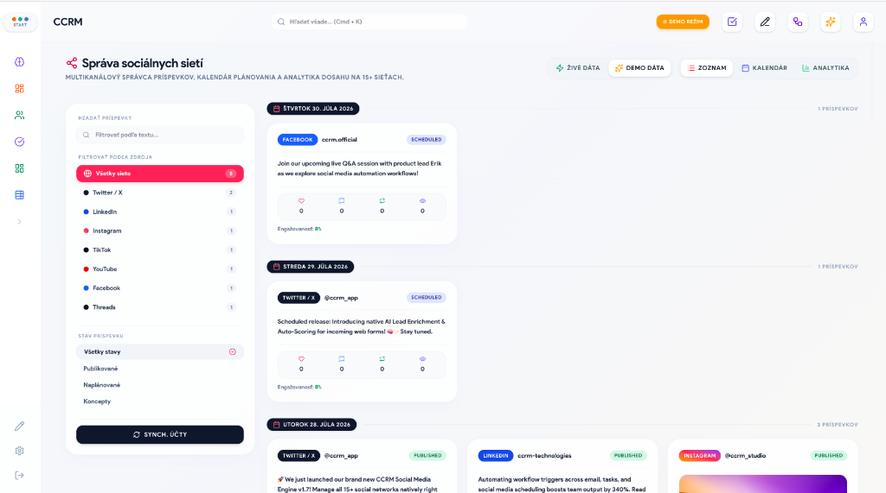

### Kľúčové funkcie:
* **Správa platforiem Meta (Facebook, Instagram) & LinkedIn**: Centrálne prepojenie firemných profilov.
* **Plánovač príspevkov a obsahový kalendár**: Príprava, schvaľovanie a časované publikovanie príspevkov.
* **Zber dopytov z komentárov a správ**: Automatické preklápanie správ od záujemcov priamo do predajného lievika ako nových leadov.

### 💡 Prečo je to pre firmu užitočné:
* Spája marketing a obchod do jedného plynulého toku.
* Umožňuje marketingovému tímu efektívne riadiť komunikáciu na sociálnych sieťach bez straty kontextu s CRM.

### 🛠️ Čo to rieši:
* **Stratené dopyty na sociálnych sieťach**: Záujemcovia v komentároch a správach na Facebooku/Instagrame neprepadnú, ale sa okamžite stanú obchodným prípadom v CRM.

---

## 13. 📈 Analytika & Vlastné AI Nástenky (Dashboards)

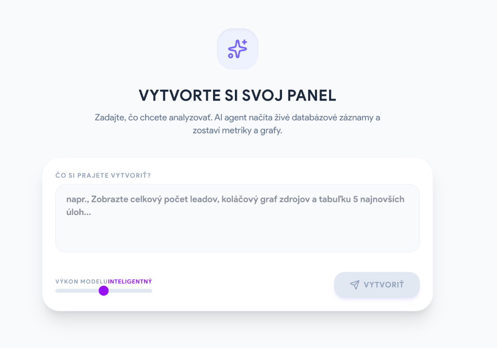

### Kľúčové funkcie:
* **Manažérsky Executive Dashboard**: Živé ukazovatele obratu, konverzných pomerov, úspešnosti obchodníkov, zdrojov zákaziek a dôvodov ich straty.
* **Generatívne AI Dashboardy (Custom Dashboards)**: Vytvorenie vlastného analytického panelu zadaním textovej požiadavky (napr. *"Zostav mi prehľad top 5 najpredávanejších produktov a ich marže za posledný kvartál"*).

### 💡 Prečo je to pre firmu užitočné:
* Poskytuje vedeniu objektívne, dátami podložené podklady pre strategické a obchodné rozhodnutia.
* Umožňuje flexibilne vytvárať špecializované reporty pre rôzne oddelenia behom pár sekúnd.

### 🛠️ Čo to rieši:
* **Rozhodovanie "podľa pocitu"**: Nahrádza dohady exaktnými dátami o výkonnosti obchodu, skladu a financií.
* **Drahý vývoj vlastných reportov**: Nie je potrebné platiť programátorom za každú novú tabuľku či graf – AI ich zostaví sama.

---

## 14. 📂 Centrálna správa súborov & Dokumentov (Files)

### Kľúčové funkcie:
* **Centrálny Asset Hub**: Prehľadné úložisko všetkých súborov, zmlúv, výkresov, fotografií a faktúr v systéme.
* **Okamžitý náhľad dokumentov (Preview Pane)**: Prezeranie PDF, obrázkov a tabuliek priamo v okne CRM bez nutnosti ich sťahovania na lokálny disk.
* **Filtrovanie podľa väzieb**: Okamžité vyfiltrovanie súborov patriacich ku konkrétnemu klientovi alebo zákazke.

### 💡 Prečo je to pre firmu užitočné:
* Šetrí čas pri dohľadávaní dôležitých dokumentov, projektovej dokumentácie a zmlúv.
* Zabezpečuje, že každý oprávnený zamestnanec má okamžitý prístup k najnovšej verzii podkladov.

### 🛠️ Čo to rieši:
* **Hľadanie súborov na rôznych počítačoch a mailoch**: Všetky súbory sú bezpečne uložené priamo pri príslušnom klientovi alebo zákazke.
* **Zdržanie pri sťahovaní veľkých súborov**: Vďaka internému prehliadaču je možné si výkres alebo zmluvu overiť za 1 sekundu.

---

## 15. 🪟 Start Menu & Používateľské prispôsobenie

### Kľúčové funkcie:
* **Windows-style Start Menu**: Prehľadný centrálny launcher všetkých modulov rozdelených do kategórií (*Operatíva, Analytika, Spolupráca, Systém*).
* **Pripínanie na bočný panel (Pin / Unpin)**: Možnosť nechať si na lište len tie nástroje, ktoré denne používate.
* **Drag & Drop usporiadanie**: Intuitívne preskupenie položiek a tvorba vlastných skupín.

---

## 16. 🔒 Bezpečnosť, Používateľské práva & Administrácia (Settings)

### Kľúčové funkcie:
* **Granulárne prístupové práva (RBAC)**: Nastavenie rolí (*Admin, Projektový manažér, Obchodník, Skladník, Účtovník, Viewer*) s presnými právami pre zobrazenie, úpravu, mazanie a správu jednotlivých sekcií.
* **Plná viacjazyčnosť (i18n)**: Natívne prepínanie medzi **Slovenčinou (SK)**, **Angličtinou (EN)** a **Maďarčinou (HU)**.
* **Audit Log & Bezpečnostný záznam**: Presný záznam o tom, kto, kedy a aké zmeny v systéme vykonal.
* **Univerzálne rýchle vyhľadávanie (`Ctrl/Cmd + K`)**: Globálne bleskové vyhľadanie klienta, tovaru, úlohy či zákazky odkiaľkoľvek v systéme.
* **Centrum noviniek (Update Notes)**: Interaktívne prehľady aktualizácií systému so snímkami obrazovky pre plynulé vzdelávanie používateľov.

### 💡 Prečo je to pre firmu užitočné:
* Chráni citlivé firemné know-how a finančné dáta pred neoprávneným prístupom zamestnancov alebo brigádnikov.
* Zabezpečuje maximálnu používateľskú prívetivosť – každý zamestnanec vidí len tie nástroje, ktoré reálne potrebuje pre svoju prácu.

### 🛠️ Čo to rieši:
* **Úniky citlivých informácií a zneužitie dát**: Obchodník vidí len svoje zákazky, skladník nevidí do firemného účtovníctva a brigádnik nemôže zmazať databázu.
* **Preplnené a mätúce používateľské rozhranie**: Vďaka prispôsobeniu bočného panela a Start Menu má každý používateľ pred sebou čisté, prehľadné pracovisko.

---

## 🎯 Zhrnutie pre prezentáciu (Executive Summary):

> **Koperniq** nie je len jednoduchá databáza kontaktov, ale **kompletný operačný systém firmy**. Spája **Obchod (CRM)**, **Sklad a Logistiku**, **Financie a Cash Flow**, **Riadenie projektov**, **Tímové úlohy** a **Pokročilú umelú inteligenciu (AI)** do jedného zosynchronizovaného celku. 
> 
> Výsledkom pre firmu je **odstránenie chaosu, úspora desiatok hodín týždenne na rutinných činnostiach, zamedzenie finančným únikom a okamžitý prehľad o ziskovosti v reálnom čase.**
